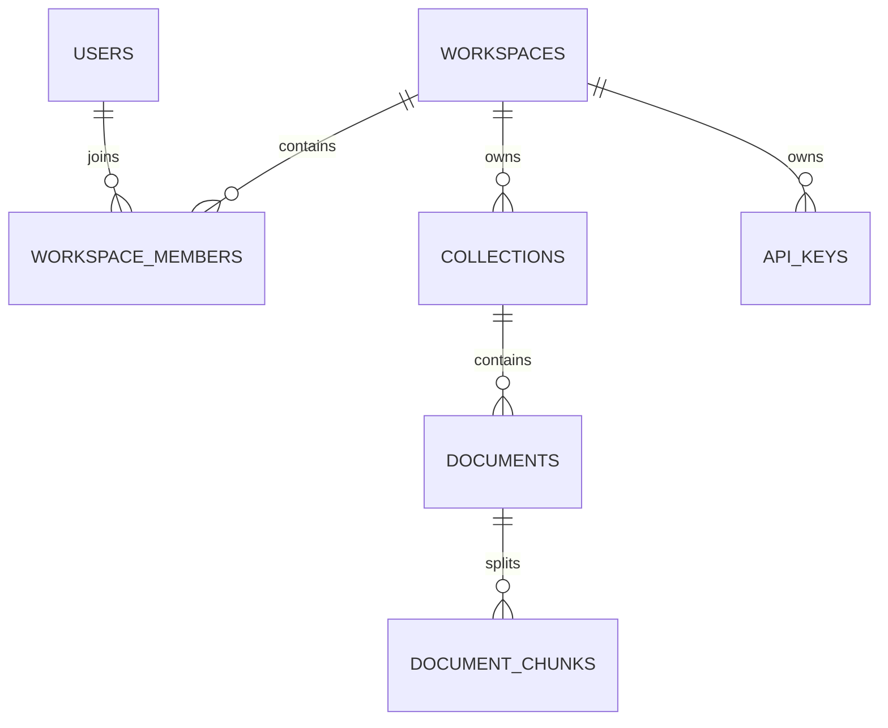

# Database Design

`users` has many `workspace_members`; `workspaces` have collections, documents and API keys; documents have chunks. Foreign keys and workspace-scoped indexes make authorization and list queries efficient. `workspace_members(workspace_id,user_id)` is unique. API-key hashes are unique, while plaintext keys never enter the database.

Production migrations should be generated/reviewed with Alembic. The initial local schema is created at startup for a zero-config demonstration; replace this with `alembic upgrade head` before production deployment.
