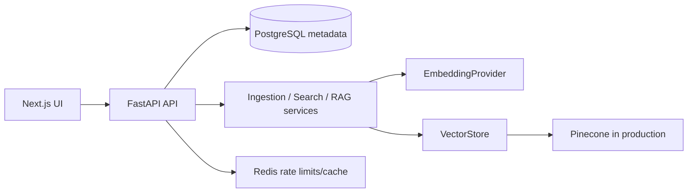

# System Design

VectorVault provides tenant-isolated ingestion, retrieval, and grounded answers for developer applications.

Authentication issues short-lived access JWTs and refresh JWTs. Every workspace route resolves membership before accessing a collection, document, vector namespace, or API key. Ingestion validates an untrusted upload, checks its checksum in the workspace, extracts text, normalizes/chunks it, embeds batches, upserts vectors, then commits chunk metadata and a completed status. A failure marks the document failed rather than completed.

At scale, move ingestion to a durable worker queue, use Pinecone namespaces per workspace, add a managed Redis limiter, and horizontally scale stateless API replicas. Pinecone/LLM failures should return controlled 503 responses and leave jobs retryable.
